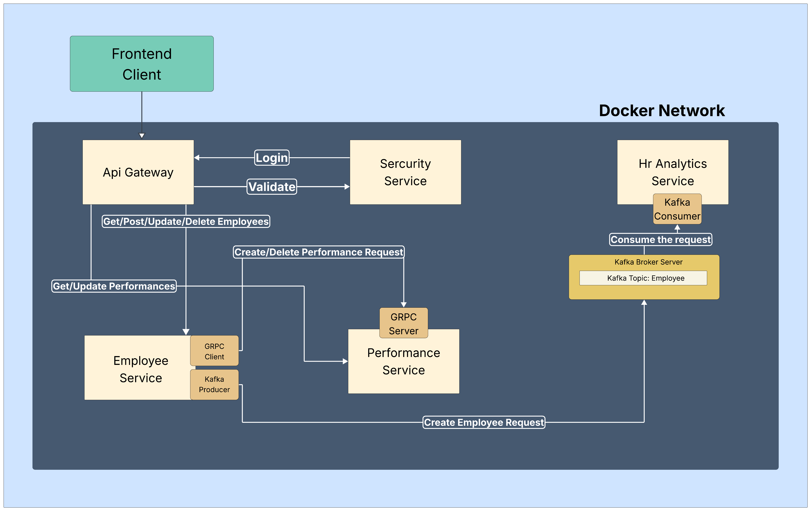
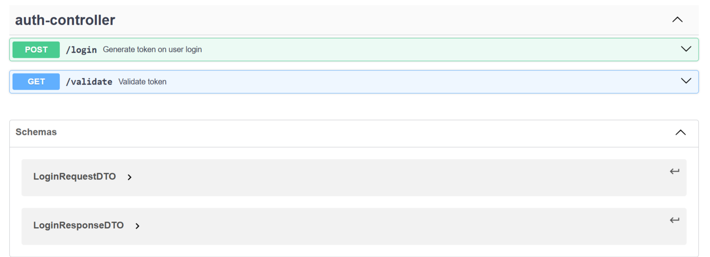
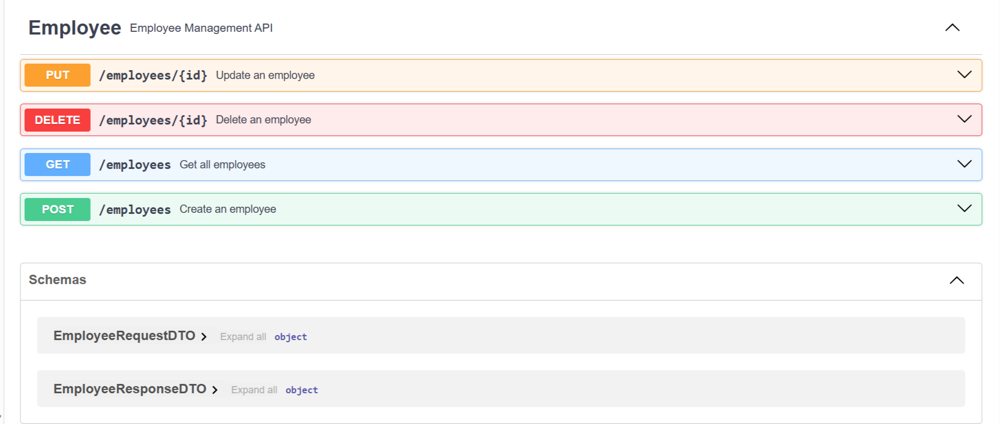
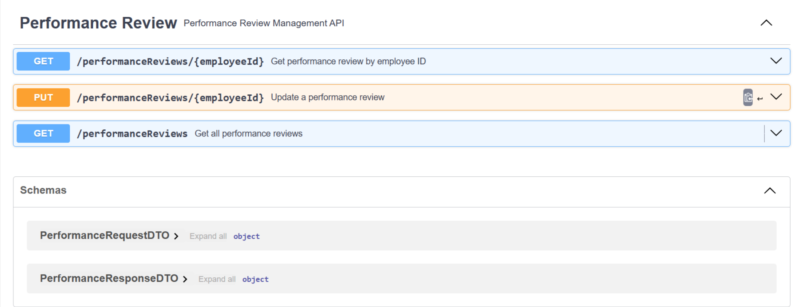

# 🏢 Employee Management System Microservices
---

#### 🗂️ A scalable and modular Employee Management System built using microservices architecture. 
The system consists of 5 independently deployable services, documented with `OpenAPI`, 
using `gRPC` for synchronous and `Kafka` for asynchronous messaging and containerized using `Docker` for easy orchestration and deployment.

---
## ✨Key Highlights
- 🔐 Built secure and efficient `REST APIs` using Spring Boot with `JWT-based authentication`
- ⚡ Employed `gRPC` for fast inter-service communication and 📩 `Apache Kafka` for asynchronous messaging
- 🛡️ Created a centralized `API Gateway` to handle routing, security, and request forwarding across services
- 🐳 Used `Docker` to containerize each service and `Docker Compose` to orchestrate all services 
- 🛢️ Leveraged `PostgreSQL` as the primary database, integrated via Docker containers
- 📃 Documented each service using `OpenAPI (Swagger)` for easy collaboration and maintenance
- 🧱 Designed the system for scalability, security, and independent service deployment
---
## 🧩 Microservices Overview
The system follows a microservices architecture with independently deployable services, each having a specific responsibility:

### 🛡️ API Gateway

  CLICK TO EXPAND 

  
   
  
- Acts as the entry point for all client requests.
- Uses a custom `GatewayFilter` to validate JWT tokens and forward requests securely to appropriate microservices.
- Ensures centralized security and request routing.

### 🔐 Security Service

 CLICK TO EXPAND 

  
   
  
- Handles authentication and authorization using JWT (JSON Web Tokens).
- Provides endpoints for token generation and validation.
- Persists authentication-related data in a PostgreSQL database (`security-service-DB`).

### 👨‍💼 Employee Service

  CLICK TO EXPAND 

  
   
  
- Responsible for CRUD operations on employee data.
- On creation of an employee:
  - Sends a gRPC request to `performance-service` to create a performance record.
  - Publishes an event on the Kafka `employee topic` for asynchronous processing.
  - Uses PostgreSQL (`employee-service-DB`) for data persistence.
- On deletion of an employee:
  - deletes the employee record from `employee-service-DB`
  - Sends a gRPC request to `performance-service` to delete a performance record.

### 📊 Performance Service

 CLICK TO EXPAND 

  
   
  
- Manages performance reviews of employees.
- Supports updating, retrieving performance data.
- Accepts gRPC calls from the `employee-service` for creation and deletion of performance record.
- Data is stored in PostgreSQL (`performance-service-DB`).

### 📈 HR Analytics Service (Demo Service)

  CLICK TO EXPAND 

  
   
  
- Demonstrates event-driven microservice communication.
- Consumes create employee events from the Kafka `employee-topic`.
- Showcases real-time data syncing using Kafka-based message consumption.

### 🗄️ Databases & Message Brokers

  This system uses Dockerized databases and Kafka for seamless integration and scaling.
  

  CLICK TO EXPAND 

  
   
  
- #### 🗃️ PostgreSQL Containers
  Each core service has its own dedicated PostgreSQL database container:
  - `security-service-DB` – Stores valid authenticated users from SQL script.
  - `employee-service-DB` – Stores employee information and records.
  - `performance-service-DB` – Stores performance-related data for employees.

#### 🔁 Kafka Infrastructure
- Kafka Broker runs inside a container for handling real-time messaging.
- Maintains a topic named `employee-topic` which:
  - Receives events from `employee-service` on employee creation.
  - Is consumed by services like `hr-analytics-service` for analytics and further processing.

---

## 🧩 Project Dependencies
This project uses a powerful set of tools and libraries that enable secure, scalable, and maintainable development using the microservices architecture.   
**Here's a breakdown of the core dependencies:**

  CLICK TO EXPAND 

  
   
  
- ☕ Backend Frameworks & Libraries
  - `Spring Boot` — Simplifies the bootstrapping and development of Spring-based applications with minimal configuration.
  - `Spring DevTools` — Enables hot reloading and automatic restarts for a faster development experience.
  - `Spring Security` — Provides comprehensive security features including authentication, authorization, and protection against common vulnerabilities.
  - `Spring Data JPA` — Simplifies database operations using Java Persistence API with minimal boilerplate code.
  - `Spring Cloud Gateway` — A lightweight API Gateway built on Spring Boot for routing, filtering, and securing requests across services.
  - `Spring Web` — Supports RESTful API development using Spring MVC.

- 🔐 Security
  - `Validation` — Ensures input data adheres to expected formats using annotations like @Valid and @NotNull.
  - `JWT (JSON Web Token)` — Used for securely transmitting information between parties, especially for stateless authentication.
    
- ⚡ Inter-Service Communication
  - `Protobuf (Protocol Buffers)` — A language-neutral, platform-neutral extensible mechanism for serializing structured data (used in gRPC).
  - `gRPC` — A high-performance, open-source universal RPC framework for inter-service communication.

- 📡 Event Streaming
  - Kafka — Used for distributed event streaming; enables asynchronous communication between microservices using topics.

- 🐳 Containerization
  - `Docker` — Containerizes each service for consistent environments across development and production.
  - `Docker Compose` — Orchestrates multiple containers including microservices, databases, and Kafka broker using a single YAML file.

- 🛠️ Build & Dependency Management
  - `Maven` — Handles project builds, dependencies, and plugin management using a centralized pom.xml.

- 🛢️ Database & Drivers
  - `PostgreSQL Driver` — JDBC driver for connecting to PostgreSQL databases used by microservices.

- 📄 API Documentation
  - `OpenAPI / Swagger` — Automatically generates interactive API documentation for REST endpoints.

---

## Architecture Diagram

---

## 📬 API Documentation Snapshot
This image showcases the OpenAPI (Swagger) documentation for the Employee Management System.
It provides a visual overview of the available REST endpoints, request/response structures, and service contracts for each microservice.
The documentation was generated automatically and helps developers and testers interact with the APIs efficiently during development and debugging.

### Auth Controller

### Employee Controller

### Performance Controller

---

## 🐳 Docker Compose Integration
`Docker Compose` is used to streamline the orchestration of all microservices, supporting containers, and environments required for this project. It allows us to define and manage multiple containers in a single `YAML` file, ensuring all services start in the correct order with appropriate configurations and ports.

### ✅ Services Managed via docker-compose.yml:
- API Gateway
- Security Service
- Employee Service
- Performance Service
- HR Analytics Service
- PostgreSQL Containers:
  - security-service-DB
  - employee-service-DB
  - performance-service-DB
- Kafka Broker with employee-topic

▶️ Running the Entire Project:
To build and start all services, simply run:
<pre>docker-compose up --build</pre>
This command:
- Builds all the images defined in the docker-compose.yml
- Creates the containers
- Runs them concurrently with appropriate networks, environment variables, and port mappings

To stop all running containers:
<pre> docker-compose down </pre>

---

## 🛠️Steps to Run Your Project from GitHub

1. Clone the Repository
<pre> git clone https://github.com/your-username/your-repo.git
cd your-repo </pre>

2. Generate gRPC Files
<pre>mvn clean compile</pre>

3. Make Sure Docker and Docker Compose Are Installed
<pre>docker --version
docker-compose --version</pre>

4. Run the Whole Project with Docker Compose
<pre>docker-compose up --build
</pre>

5. Import the collection of postman requests from the project 

6. Stop the Project (when done)
<pre>docker-compose down
</pre>

---
